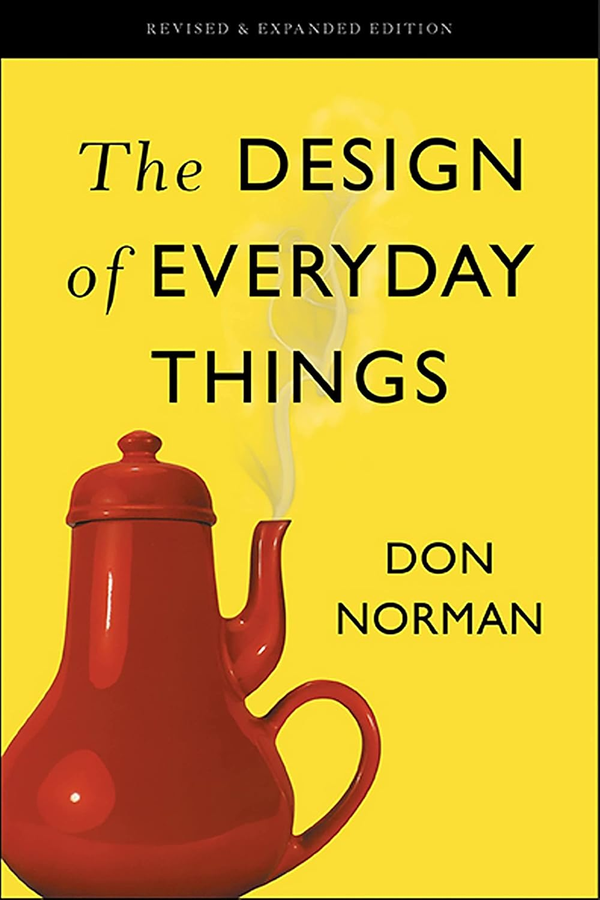

## {transition="slide-in fade-out"}

::::: columns

:::: {.column width="40%"}
::: {.fragment .fade-out fragment-index=2 .absolute top=0}
{width="60%"}
:::
::: {.fragment .fade-in-then-out fragment-index=2 .absolute top=0 .big-img}
{width="100%"}
:::
::: {.fragment .fade-in fragment-index=3 .absolute top=0 .big-img}
::: {.fragment .fade-out fragment-index=5}
{width="100%"}
:::
:::
::: {.fragment .fade-in-then-out fragment-index=5 .absolute top=0 .big-img}
{width="110%"}
:::
::: {.fragment .fade-in fragment-index=6 .absolute top=0 .big-img}
::: {.fragment .fade-out fragment-index=8}
{width="38%"}
:::
:::
::: {.fragment .fade-in-then-out fragment-index=8 .absolute top=0}
{width="40%"}
:::
::: {.fragment .fade-in fragment-index=9 .absolute top=0 .big-img}
{width="150%"}
:::
::::

:::: {.column width="60%"}
::: {.fragment fragment-index=1}
**"All artificial things are designed."**
<br>
<br>
:::
::: {.fragment .custom-bullet fragment-index=4}
{width="75px"} Make functionality obvious
:::
::: {.fragment fragment-index=7}
🔋 Forgive "close enough" input
:::
::: {.fragment fragment-index=10}
ℹ️ Help users fix mistakes
:::
:::: 
:::::


# Make functionality obvious

## What does this function do? {transition="fade-in fade-out"}

```{r}
#| code-line-numbers: 1-10|1-1
my_fun <- function(x, y, z) {
  y2 <- ceiling(y * z * 100) / 100
  y3 <- y + y2
  data.frame(
    item = x,
    price = y,
    sales_tax = y2,
    total_price = y3
  )
}
```

## Make it obvious what functions do {transition="fade-in fade-out"}

```{r}
#| code-line-numbers: 1-1
compile_sales_df <- function(x, y, z) {
  y2 <- ceiling(y * z * 100) / 100
  y3 <- y + y2
  data.frame(
    item = x,
    price = y,
    sales_tax = y2,
    total_price = y3
  )
}
```

## Make it obvious what functions do {transition="fade-in fade-out"}

```{r}
#| code-line-numbers: 1-1
compile_sales_df <- function(items, prices, tax_rate) {
  y2 <- ceiling(y * z * 100) / 100
  y3 <- y + y2
  data.frame(
    item = x,
    price = y,
    sales_tax = y2,
    total_price = y3
  )
}
```

## Make it obvious what functions do {transition="fade-in fade-out"}

```{r}
#| code-line-numbers: 1-10|1-1
compile_sales_df <- function(items, prices, tax_rate) {
  sales_tax <- ceiling(prices * tax_rate * 100) / 100
  total_price <- prices + sales_tax
  data.frame(
    item = items,
    price = prices,
    sales_tax = sales_tax,
    total_price = total_price
  )
}
```

## Make it obvious what functions do {transition="fade-in fade-out"}

```{r}
#| code-line-numbers: 1-1
#| eval: true
compile_sales_df <- function(items, prices, tax_rate = 0.0825) {
  sales_tax <- ceiling(prices * tax_rate * 100) / 100
  total_price <- prices + sales_tax
  data.frame(
    item = items,
    price = prices,
    sales_tax = sales_tax,
    total_price = total_price
  )
}
```

## The function works with "normal" input {transition="fade-in fade-out"}

```{r}
compile_sales_df(
  items = c("paper towels", "toilet paper"),
  prices = c(12.33, 20.77)
)
```

## The function works with "normal" input {transition="fade-in fade-out"}

```{r}
#| code-line-numbers: 1-4
#| eval: true
compile_sales_df(
  items = c("paper towels", "toilet paper"),
  prices = c(12.33, 20.77)
)
```

## What happens if data types are incorrect? {transition="fade-in fade-out"}

```{r}
#| code-line-numbers: 1-4|3-3
compile_sales_df(
  items = c("paper towels", "toilet paper"),
  prices = c(12.33, 20.77)
)
```

## What happens if data types are incorrect? {transition="fade-in fade-out"}

```{r}
#| code-line-numbers: 3-3
compile_sales_df(
  items = c("paper towels", "toilet paper"),
  prices = c("12.33", "20.77")
)
```

## What happens if data types are incorrect? {transition="fade-in fade-out"}

```{r}
#| code-line-numbers: 3-3
#| eval: true
#| error: true
compile_sales_df(
  items = c("paper towels", "toilet paper"),
  prices = c("12.33", "20.77")
)
```

# Forgive "close enough" input

## Forgive "close enough" input {transition="slide-in fade-out"}

```{r}
#| code-line-numbers: 1-10|2-2
compile_sales_df <- function(items, prices, tax_rate = 0.0825) {
  sales_tax <- ceiling(prices * tax_rate * 100) / 100
  total_price <- prices + sales_tax
  data.frame(
    item = items,
    price = prices,
    sales_tax = sales_tax,
    total_price = total_price
  )
}
```

## Forgive "close enough" input {transition="fade-in slide-out"}

```{r}
#| code-line-numbers: 2-3|2-2
#| eval: true
compile_sales_df <- function(items, prices, tax_rate = 0.0825) {
  prices <- stbl::to_dbl(prices)
  sales_tax <- ceiling(prices * tax_rate * 100) / 100
  total_price <- prices + sales_tax
  data.frame(
    item = items,
    price = prices,
    sales_tax = sales_tax,
    total_price = total_price
  )
}
```

## Forgive "close enough" input {transition="slide-in fade-out"}

```{r}
#| code-line-numbers: 3-3
compile_sales_df(
  items = c("paper towels", "toilet paper"),
  prices = c("12.33", "20.77")
)
```

## Forgive "close enough" input {transition="fade-in slide-out"}

```{r}
#| code-line-numbers: 3-3
#| eval: true
compile_sales_df(
  items = c("paper towels", "toilet paper"),
  prices = c("12.33", "20.77")
)
```

## Why did I make this package? {transition="slide-in fade-out"}

```{r}
#| code-line-numbers: 2-2
compile_sales_df <- function(items, prices, tax_rate = 0.0825) {
  prices <- stbl::to_dbl(prices)
  sales_tax <- ceiling(prices * tax_rate * 100) / 100
  total_price <- prices + sales_tax
  data.frame(
    item = items,
    price = prices,
    sales_tax = sales_tax,
    total_price = total_price
  )
}
```

## Why did I make this package? {transition="fade-in fade-out"}

```{r}
#| code-line-numbers: 2-2
#| eval: true
compile_sales_df <- function(items, prices, tax_rate = 0.0825) {
  prices <- as.double(prices)
  sales_tax <- ceiling(prices * tax_rate * 100) / 100
  total_price <- prices + sales_tax
  data.frame(
    item = items,
    price = prices,
    sales_tax = sales_tax,
    total_price = total_price
  )
}
```

## Why did I make this package? {transition="fade-in fade-out"}

```{r}
#| code-line-numbers: 2-3
#| eval: true
compile_sales_df(
  items = c("paper towels", "toilet paper"),
  prices = c("12.33", "20.77")
)
```

## Why did I make this package? {transition="fade-in fade-out"}

```{r}
#| code-line-numbers: 2-3
compile_sales_df(
  items = c("item", "price", "", ""),
  prices = c("paper towels", "12.33", "toilet paper", "20.77")
)
```

## Why did I make this package? {transition="fade-in slide-out"}

```{r}
#| code-line-numbers: 2-3
#| eval: true
#| warning: true
compile_sales_df(
  items = c("item", "price", "", ""),
  prices = c("paper towels", "12.33", "toilet paper", "20.77")
)
```

# Help users fix mistakes

## Help users fix mistakes

```{r}
#| code-line-numbers: 2-2
#| eval: true
compile_sales_df <- function(items, prices, tax_rate = 0.0825) {
  prices <- stbl::to_dbl(prices)
  sales_tax <- ceiling(prices * tax_rate * 100) / 100
  total_price <- prices + sales_tax
  data.frame(
    item = items,
    price = prices,
    sales_tax = sales_tax,
    total_price = total_price
  )
}
```

## Help users fix mistakes {transition="slide-in fade-out"}

```{r}
compile_sales_df(
  items = c("item", "price", "", ""),
  prices = c("paper towels", "12.33", "toilet paper", "20.77")
)
```

## Help users fix mistakes {transition="fade-in slide-out"}

```{r}
#| eval: true
#| error: true
compile_sales_df(
  items = c("item", "price", "", ""),
  prices = c("paper towels", "12.33", "toilet paper", "20.77")
)
```

## Help users fix mistakes {transition="slide-in fade-out"}

```{r}
#| code-line-numbers: 2-2
compile_sales_df <- function(items, prices, tax_rate = 0.0825) {
  prices <- stbl::to_dbl(prices)
  sales_tax <- ceiling(prices * tax_rate * 100) / 100
  total_price <- prices + sales_tax
  data.frame(
    item = items,
    price = prices,
    sales_tax = sales_tax,
    total_price = total_price
  )
}
```

## Help users fix mistakes {transition="fade-in fade-out"}

```{r}
#| code-line-numbers: 2-8
#| eval: true
compile_sales_df <- function(items, prices, tax_rate = 0.0825) {
  prices <- stbl::to_dbl(prices) |>
    stbl::replace_stbl_error(
      c(
        "{.arg prices} must be numeric",
        i = "Check that the input CSV is formatted correctly"
      )
    )
  sales_tax <- ceiling(prices * tax_rate * 100) / 100
  total_price <- prices + sales_tax
  data.frame(
    item = items,
    price = prices,
    sales_tax = sales_tax,
    total_price = total_price
  )
}
```

## Help users fix mistakes {transition="fade-in fade-out"}

```{r}
#| code-line-numbers: 2-9
compile_sales_df <- function(items, prices, tax_rate = 0.0825) {
  prices <- stbl::to_dbl(prices) |>
    stbl::replace_stbl_error(
      c(
        "{.arg prices} must be numeric",
        i = "Check that the input CSV is formatted correctly"
      ),
      subclass = c("incompatible_values")
    )
  sales_tax <- ceiling(prices * tax_rate * 100) / 100
  total_price <- prices + sales_tax
  data.frame(
    item = items,
    price = prices,
    sales_tax = sales_tax,
    total_price = total_price
  )
}
```

## Help users fix mistakes {transition="fade-in slide-out"}

```{r}
#| code-line-numbers: 2-9
#| eval: true
compile_sales_df <- function(items, prices, tax_rate = 0.0825) {
  prices <- stbl::to_dbl(prices) |>
    stbl::replace_stbl_error(
      c(
        "{.arg prices} must be numeric",
        i = "Check that the input CSV is formatted correctly"
      ),
      subclass = c("incompatible_values", "double")
    )
  sales_tax <- ceiling(prices * tax_rate * 100) / 100
  total_price <- prices + sales_tax
  data.frame(
    item = items,
    price = prices,
    sales_tax = sales_tax,
    total_price = total_price
  )
}
```

## Help users fix mistakes {transition="slide-in fade-out"}

```{r}
compile_sales_df(
  items = c("item", "price", "", ""),
  prices = c("paper towels", "12.33", "toilet paper", "20.77")
)
```

## Help users fix mistakes {transition="fade-in fade-out"}

```{r}
#| eval: true
#| error: true
compile_sales_df(
  items = c("item", "price", "", ""),
  prices = c("paper towels", "12.33", "toilet paper", "20.77")
)
```

## Help users fix mistakes {transition="fade-in slide-out"}

```{r}
#| eval: true
#| error: true
#| echo: false
compile_sales_df(
  items = c("item", "price", "", ""),
  prices = c("paper towels", "12.33", "toilet paper", "20.77")
)
```

::: fragment
[https://style.tidyverse.org](https://style.tidyverse.org)
:::
::: fragment
[https://cli.r-lib.org/](https://cli.r-lib.org/)
:::

::: fragment
❗ Problem statement
:::

::: fragment
ℹ️ Suggestions 
:::

::: fragment
❌ Exact issue (if known) 
:::

::: fragment
🔵 More info 
:::

# You are a designer

## You are a designer

::::: columns

:::: {.column width="50%"}
{width="100%"}
::::

:::: {.column width="50%"}
::: {.fragment .custom-bullet}
{width="75px"} Make functionality obvious
:::
::: fragment
🔋 Forgive "close enough" input
:::
::: fragment
ℹ️ Help users fix mistakes
:::
::: fragment
<br>
[stbl.wrangle.zone](https://stbl.wrangle.zone)
:::
:::: 
:::::

# Thank you!
